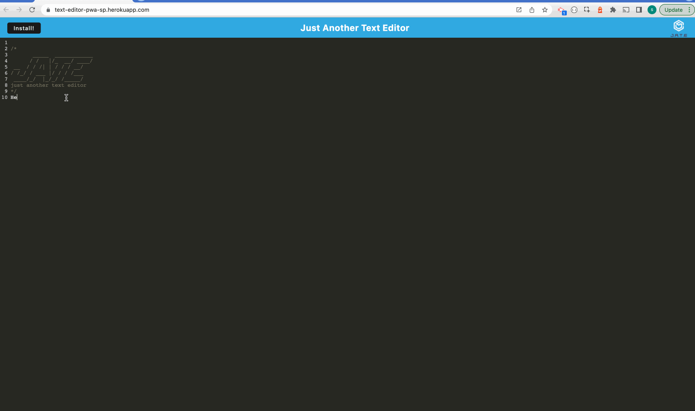

# Text Editor

## Description

Text Editor is a Progressive Web Application where a user can use it in any browser to create notes or code snippets without an internet connection. It saves the content inside the text editor.

Here is the link to the [deployed application](https://text-editor-pwa-sp.herokuapp.com/)

### Features

- Easy to navigate
- Works offline

## Table of Contents

- [Installation](#installation)
- [Usage](#usage)
- [Technologies Used](#technologies-used)
- [Credits](#credits)
- [License](#license)

## Installation

- Create a new repository on your GitHub account.
- Clone this repository.
- Run `npm install`
- Run `npm run start` at root directory.

## Usage

This project can be used in any web browser or on any devices including the mobile devices.

The following is the demo screenshot of the deployed application.



Following is a code snippet of the application page.

Here it refers to the method that gets all the content from the database.

```

export const getDb = async () => {
  console.log("GET from the database");
  const jateDb = await openDB("jate", 1);
  const tx = jateDb.transaction("jate", "readonly");
  const store = tx.objectStore("jate");
  const request = store.getAll();
  const result = await request;
  console.log("result.value", result);
  return result;

```

## Technologies Used

- Express.js
- IndexedDB
- CodeMirror
- Service Workers
- Heroku
- Git
- GitHub

## Credits

- npmjs.com
- MDN / W3Schools

## License

This project is licensed under the [MIT](./LICENSE) license.
